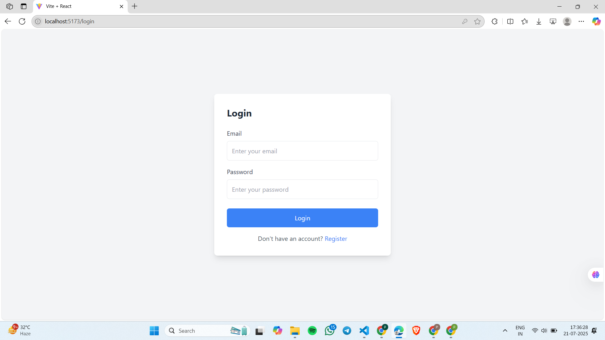
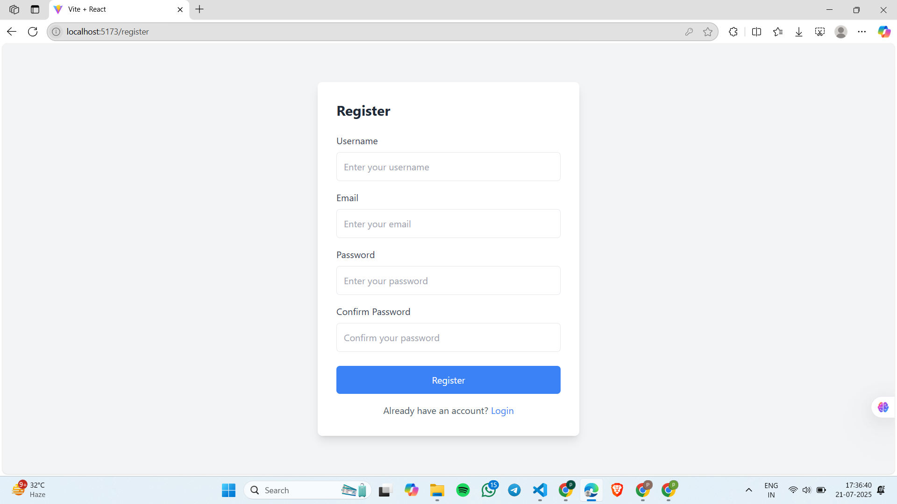
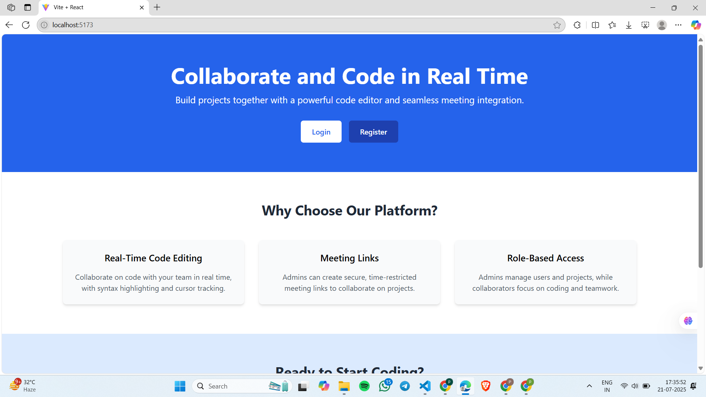
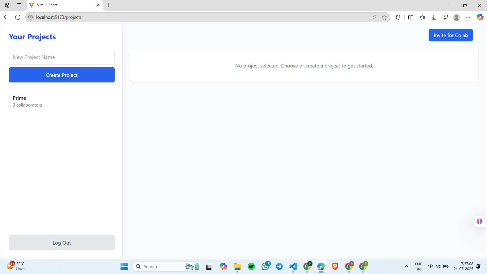
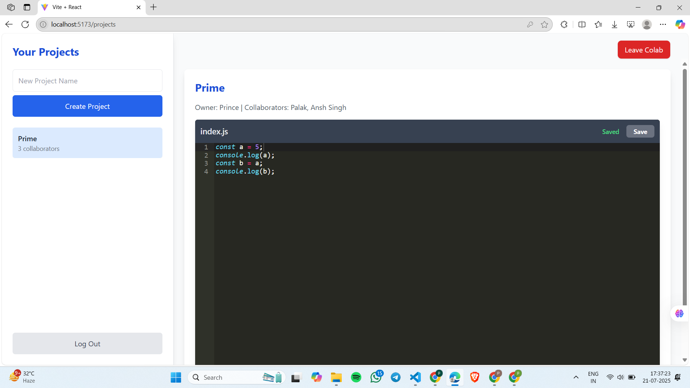

# SpaceCode 🚀

**SpaceCode** is a real-time collaborative code editor platform built using the **MERN Stack** (MongoDB, Express, React, Node.js), **Socket.IO**, and **TailwindCSS**. It allows developers to create, share, and collaboratively edit code projects in real time with seamless authentication, live synchronization, and session-based access control.

---

## 🌐 Live Screenshots

| Login Page            | Register Page               |
| --------------------- | --------------------------- |
|  |  |

| Home Page           | Project Dashboard                           |
| ------------------- | ------------------------------------------- |
|  |  |

| Real-Time Code Editor                    | Invite Collaborators                  |
| ---------------------------------------- | ------------------------------------- |
|  |  |

---

## ✨ Features

* 🔐 **JWT Authentication**: Secure login/register with token-based session handling.
* 🧑‍💻 **Real-time Code Editing**: Collaborate on code projects live with others using **Socket.IO**.
* 📁 **Project Management**: Create, update, and manage multiple code projects.
* 🤝 **Invite-based Collaboration**: Invite users to collaborate using secure invite links.
* 🧭 **Role Management**: Admin and collaborator roles with access control.
* 📆 **Timed Sessions**: Default collaboration sessions last 60 minutes.
* 🎨 **Responsive UI**: Built with TailwindCSS for seamless experience on all devices.

---

## 🛠️ Tech Stack

### Frontend:

* **React.js**
* **TailwindCSS**
* **React Icons**
* **Axios**
* **Socket.IO Client**

### Backend:

* **Node.js**
* **Express.js**
* **MongoDB + Mongoose**
* **JWT Authentication**
* **Socket.IO Server**
* **UUID for Invite Codes**

---

## 📦 Installation

```bash
# Clone the repository
git clone https://github.com/your-username/spacecode.git
cd spacecode

# Backend setup
cd backend
npm install
npm run dev

# Frontend setup
cd ../frontend
npm install
npm start
```

> ⚠️ Ensure MongoDB is running locally or provide a connection string in the `.env` file.

---

## 📁 Folder Structure (Simplified)

```
spacecode/
├── backend/
│   ├── models/
│   ├── routes/
│   ├── controllers/
│   ├── middleware/
│   ├── server.js
│   └── .env
├── frontend/
│   ├── components/
│   ├── pages/
│   ├── Context/
│   ├── App.js
│   └── tailwind.config.js
```

---

## ⚙️ Environment Variables (`.env`)

Backend:

```
MONGO_URI=mongodb://localhost:27017/spacecode
JWT_SECRET=your_jwt_secret
CLIENT_URL=http://localhost:3000
```

---

## 📌 How It Works

* User registers/logins using secure JWT.
* Dashboard allows creating projects.
* Projects can be edited in real-time.
* Collaborators can join via invite link.
* Sessions expire after 60 minutes by default.
* All changes sync live using Socket.IO.

---

## 🧪 Future Enhancements

* Code Execution Support (Python/JavaScript backend sandbox)
* Voice/Video Calls Integration
* File Upload & Download
* Syntax Highlighting Themes
* Session History Replay

---

## 📧 Contact

Made with ❤️ by **Prince Singh**

---

## 🪐 License

This project is licensed under the **MIT License**.

---

> "Code together, grow forever. SpaceCode is your launchpad to collaborative programming."
